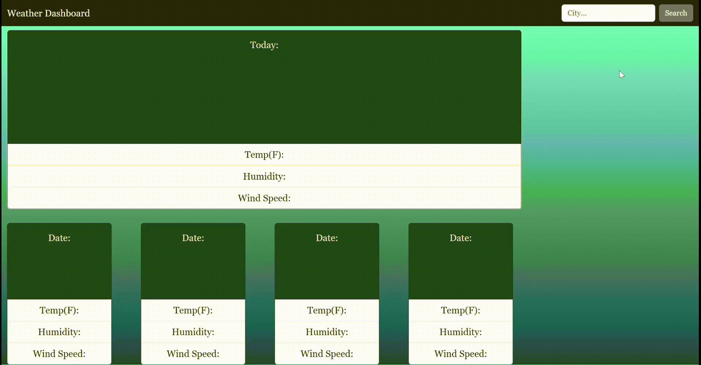
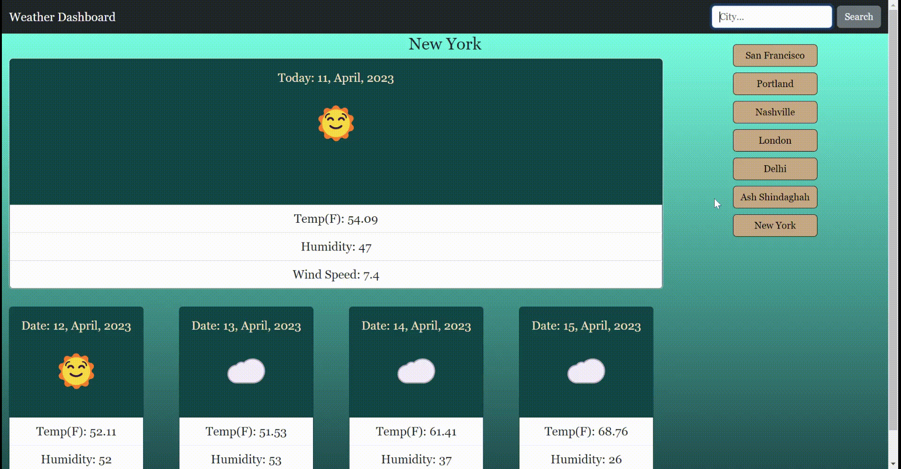

# Weather-dashboard


## Description

[Visit the Deployed Site](https://aarticontractor.github.io/weather-dashboard/)
<br>

 Weather Dashbaord is a (5) Day Weather Forecast application that provides georgraphical weather information when given by a city name using the OpenWeatherMap APIs. In this project it involved retrieving Third-party API data and implementing it into a 5 day weather forecaast. The challenge is to build a weather dashboard that will run in the browser and feature dynamically updated HTML and CSS. Usign the OpenWeatherMap APIs to retrieve weather data for cities I needed to pass in longitude and latitude coordinates to provide the given city names weather data. My localStorage has been setup to store the applications persistent data to ensure search history is maintained.


<br>
<br>
<br>
<br>

## Technology Used 

| Technology Used         | Resource URL           | 
| ------------- |:-------------:| 
| HTML    | [https://developer.mozilla.org/en-US/docs/Web/HTML](https://developer.mozilla.org/en-US/docs/Web/HTML) | 
| CSS     | [https://developer.mozilla.org/en-US/docs/Web/CSS](https://developer.mozilla.org/en-US/docs/Web/CSS)      |   
| Git | [https://git-scm.com/](https://git-scm.com/)     |  
| JavaScript | [https://developer.mozilla.org/en-US/docs/Web/JavaScript](https://developer.mozilla.org/en-US/docs/Web/JavaScript) |  
| Open Weather Map API | [https://openweathermap.org/forecast5](https://openweathermap.org/forecast5)  |
|Bootstrap| [https://getbootstrap.com/](https://getbootstrap.com/) |

<br>


## Table of Contents

* [Application Highlights and Usage](#application-highlights-and-usage)
* [Code Snippets](#code-snippets)
* [Learning Points](#learning-points)
* [Author Info](#author-info)
* [Credits](#credits)

<br>


## Application Highlights and Usage
<br>

The following animation demonstrates the application functionality where when the user searches for a city, then the current and future conditions for that city are presented and that city is added to the search history.

<br>
<br>



<br>
<br>
<br>
When a city in the search history is clicked, then again the user is presented with current and future conditions for that city.
<br>
<br>
<br>



<br>
<br>
<br>

## Code Snippets

<br>

The following code snippet shows the function which saves the searched city name in the local storage of the browser and displays the top 10 cities searched.

```javascript

function saveCity(cityName) {

    if (all_cities.length > 9) {
        all_cities.shift();
    }

    const index = all_cities.indexOf(cityName);
    console.log("Index is: " + index);
    console.log("ALL cities is: " + all_cities);
    if (index === -1) {
      all_cities.push(cityName);
    } else {
        all_cities.splice(index, 1);
        all_cities.push(cityName);
    }
    localStorage.setItem('top_10_cities', JSON.stringify(all_cities));

}

```

<br>
<br>
<br>

The below snippet shows the function which was used to get the lattitudes and longitudes of a city from the data object of API using API URL and shown in JSON format:

```javascript

function getLatLon(currentCity) {
    var apiUrl =
        "http://api.openweathermap.org/geo/1.0/direct?q=" +
        currentCity +
        "&limit=5&appid=" +
        apiKey;
    console.log(apiUrl)
    return fetch(apiUrl)
        .then(function (data) {
            return data.json();
        })
        .then(function (data) {
            console.log(data);
            var lat = data[0].lat;
            var lon = data[0].lon;
            return {
                lat,
                lon
            }; // return an object with lat and lon values
        })
        .catch(function (error) {
            console.log(error);
        });
}

```

<br>
<br>
<br>

## Learning Points 

   I learned the following skills while doing this project:
<br>
- Java script basics (functions, arrays, for-loops, if-else, alerts, prompts, confirm, etc)
- How to use API's and call API using the API key
- How to create a webpage using Bootstrap styles and layouts and linking them to HTML elements.
- How to store values in the local storage of the web browser


<br>

## Author Info

### Aarti Contractor


- Portfolio: https://aarticontractor.github.io/aarticontractor_portfolio/
- Linkedin: https://www.linkedin.com/in/aarti-contractor/
- Github: https://github.com/aarticontractor

<br>

## Credits

- https://getbootstrap.com/
- https://developer.mozilla.org/en-US/docs/Web/JavaScript
- https://beautifier.io/
- https://onecompiler.com/javascript/3z45t4b2m
- https://cloudconvert.com/webm-to-gif
- https://openweathermap.org/forecast5


<br>

© 2023 edX Boot Camps LLC. Confidential and Proprietary. All Rights Reserved.

